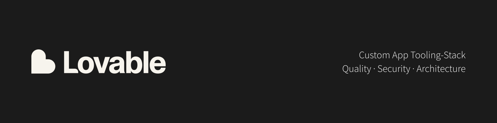

# AI Builder Toolkit

AI builder toolkit – Designed for Lovable; compatible to most platforms.

TOC

- [About](#about)
- [Why use this?](#why-use-this)
- [Who might benefit?](#who-might-benefit)
- [How does it work?](#how-does-it-work)
- [Supported stacks](#supported-stacks)
- [Packages & Pricing](#packages--pricing)
- [Get in touch](#get-in-touch)
- [Disclaimer](#disclaimer)

---

## About

Enhance reliability and scalability of any AI application, by (re)introducing a deterministic toolchain.

_This repository is a placeholder for a commercial product. Get in touch for details._

### Goals

Even if most code might be built by AI, the stack can ensure less drift, reduced bugs and thus an overall lower token use (= lower costs).

Model choice, agentic development, and code lookups (e.g. like `Context7`) will bring code only to a certain level – However, they all lack the fundamental distinction, that they 'guess' the best solution and still introduce bugs– whereas static code analyzers take a fundamentally different route, to ensure a 'higher degree of correctness'.

---

## Why use this?

- Save costs/ tokens to craft and ship features
- Save time and effort, by reducing the need for fixes, debugging and regressions
- Increase reliability of AI code generations (local and cloud-based workflows)
- Reduce drift and potential bugs in AI generated code
- Increase maintainability of code → Allow faster scaling and feature implementations
- Can increase security by limiting attack surfaces, slightly

---

## Who might benefit?

Most effective prior to a new application build, as foundation.

- AI builders with access to their codebase, wherever it is
- Build locally (e.g. via Claude Code) or via cloud-based builders/ LLMs
- Gradual/ incremental refactoring of small to medium-sized applications
- Solo-developers, who set up (their first) project from scratch, or want to improve existing ones
- Teams with limited experience in application development or AI use

---

## How does it work?

> Please reach out to discuss the details and access the code.

1. Install the code in a clean Git project
2. Setup a secure dev environment, that supports the toolchain (e.g. via Docker) – AI builders might support most tools, but not all of them, e.g. external SAAS
3. Configure Git (esp. GitHub) workflows and CI/ CD pipelines as needed
4. Connect the project to a cloud based AI builder (e.g. Lovable)
5. Use tools inside the builder or locally, depending on what is supported and best practice

---

## Supported stacks

Only stated technologies can be supported.

### Required

- React 19+
- TanStack Start
- Supabase
- Node.JS
- Docker
- Git/ GitHub

### Optional/ Addons

#### Code Analyzers, Linters & Formatters

**Linter and formatter toolchains:** Based on OpenSource stacks. There are several compatible options with preconfigured details provided. The ultimate choice depends on the overall stack and the project or teams requirements.

**External SAAS – Advanced static code analysis:** These might be recommendable for the best results. A functioning, effective default is provided, but can be exchanged, depending on the needs.

#### Skills & Prompts

While these might seem basic needs, a well-defined project is a must for any AI/ agent to be effective. There are OpenSource tools available, but it's highly recommended to enhance these with stack- and project-specific configurations.

---

## Packages & Pricing

As the packages are customizable and depend on the project size, please get in touch for a quote. Demo, trial, and support can be provided.

_No subscriptions – Accessible code is delivered as-is, with versions up to date for the time of delivery._

---

## Get in touch

Interested in a trial, stack customization or collaboration? Let's connect and chat about your next project:

 

---

## Disclaimer

Also read:

- [Limitations & Disclaimer](DISCLAIMER.md)
